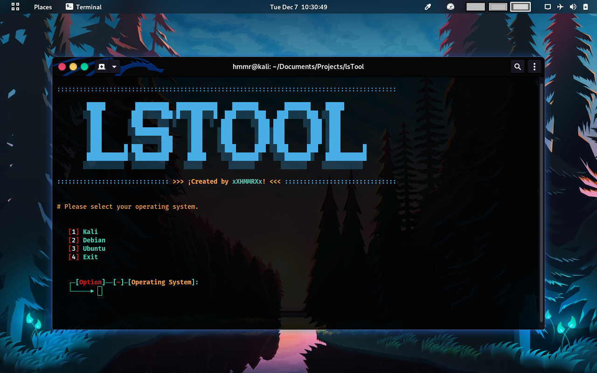

# **Login Screen Tool (lsTool)**

# **Important**

### _**Don't worry if your desktop or GNU/Linux distribution is not on the list, I will keep working to add more features soon. Thanks for using lsTool :D**_

#

## _**About lsTool**_

lsTool is a software created for the sole purpose of automating and facilitating the process of modifying the background of the login screen for GNU/Linux operating systems.

## _**List of supported GNU/Linux distributions and desktops**_

| OS                            | Desktops                        |
| ----------------------------- | ------------------------------- |
| [Kali](https://www.kali.org/) | [Gnome](https://www.gnome.org/) |

## _**Requirements**_

You need to have python3 and zenity previously installed on your GNU/Linux operating system.

### _**check python3 version**_

> $ python3 --version

If you do not have python installed you can do it with the following command:

> $ sudo apt-get update && sudo apt-get grade && sudo apt-get install python3.9

### _**check zenity version**_

> $ zenity --version

## _**How is it used?**_

### _**Step 1**_

You need to download the lsTool project.

> $ git clone https://gitlab.com/xXHMMRXx/lsTool.git

### _**Step 2**_

Enter the directory where you downloaded the lsTool project and run lsTool.sh as root.

> $ cd your_path/lsTool && sudo ./lsTool.sh

### _**Step 3**_

Select your operating system.

#

### _**Step 4**_

Select one of the available options.
Note: more options may be added in the future.

#

### _**Change background (Image)**_

Just select an image and the system will do the rest.

#

#

#

### _**Reset to default settings**_

Just select option 2 from the main menu and the system will do the rest.

#

#

## _**Contact with me**_

You can contact me directly through a private message to my [Telegram](https://telegram.org/) user @xXHMMRXx

## _**License**_

The lsTool is open-sourced software licensed under the [GPLv3](https://www.gnu.org/licenses/agpl-3.0.html 'GPLv3') license.
